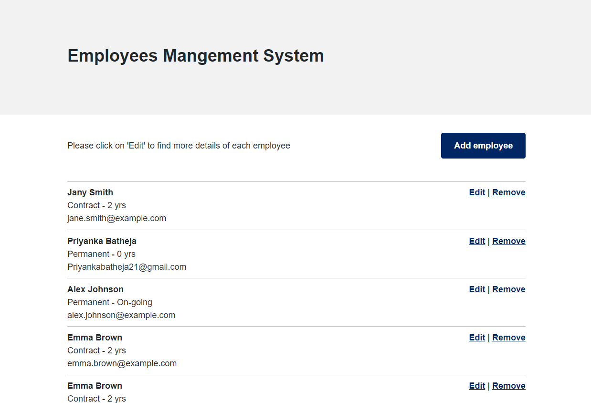

<h1> :woman_office_worker: Employee Management System :man_office_worker: </h1>

An employee management system written in Java Spring and MySQL database for the backend, and React TypeScript for the frontend. This web app allows the user to create, read, update, and delete employee details using standard CRUD operations.

## MVP

Create an employee register that allows a user to:

- [x] Create an employee
- [x] Get a list of existing employees that have been generated
- [x] Update the details of an employee
- [x] Delete an employee

## Features
- Before you delete a file, a prompt confirmation is provided to allow for user to cancel the execution (in case of accidental click)
- Redirects to default route "/employees" if route does not match.
- User Experience have been considered in the development of the form component. The date inputs have been consolidated into a single date input (less inputs for the user to complete), and the "on-going" checkbox input toggles between displaying or hidding the end-date input (so as to create less confusion for the user on input requirements).

## Reflection/Learning
Picked up React-Hook-Form, but couldn't figure out React-Query - will probably have a crack at this again for another project.
